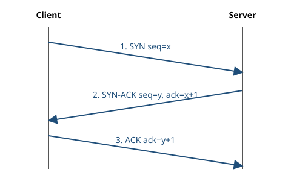

## How many segments are exchanged during the TCP connection handshake?
<!-- id: tcp-001 | level: 1 | tags: handshake -->

- [x] 3
- [ ] 2
- [ ] 4
- [ ] 1

> [!explanation]
> It is called the *three-way* handshake: SYN, SYN-ACK, then ACK.

> [!source] image
> 

> [!source] link
> [RFC 9293, §3.5 — Establishing a Connection](https://www.rfc-editor.org/rfc/rfc9293#section-3.5)

## Which flag does the client set in the first segment of the handshake?
<!-- id: tcp-002 | level: 1 | tags: handshake, flags -->

- [x] SYN
- [ ] ACK
- [ ] FIN
- [ ] RST

> [!source] image
> 

> [!source] link
> [RFC 9293, §3.5 — Establishing a Connection](https://www.rfc-editor.org/rfc/rfc9293#section-3.5)

## What does the server answer to a client's SYN when it accepts the connection?
<!-- id: tcp-003 | level: 2 | tags: handshake, flags -->

- [x] A segment with both the SYN and ACK flags set
- [ ] A segment with only the ACK flag set
- [ ] A segment with only the SYN flag set
- [ ] Nothing until the client sends data

> [!explanation]
> The server acknowledges the client's SYN (ACK) and sends its own initial sequence number (SYN) in the same segment.

> [!source] image
> 

## UDP also opens a connection with a handshake before sending data.
<!-- id: tcp-004 | level: 1 | type: true-false | answer: false | tags: udp -->

> [!explanation]
> UDP is connectionless: each datagram is sent on its own, without any prior handshake.

> [!source] link
> [RFC 768 — User Datagram Protocol](https://www.rfc-editor.org/rfc/rfc768)

## The client's SYN carries the sequence number x. Which acknowledgment number does the server's SYN-ACK carry?
<!-- id: tcp-005 | level: 3 | tags: handshake, sequence-numbers -->

- [x] x + 1
- [ ] x
- [ ] 0
- [ ] y + 1, where y is the server's sequence number

> [!explanation]
> The SYN flag consumes one sequence number, so the server acknowledges x + 1: the next byte it expects from the client.

> [!source] image
> 

> [!source] link
> [RFC 9293, §3.5 — Establishing a Connection](https://www.rfc-editor.org/rfc/rfc9293#section-3.5)

## Which RFC is the current specification of TCP?
<!-- id: tcp-006 | level: 2 | tags: standards -->

- [x] RFC 9293
- [ ] RFC 793
- [ ] RFC 768
- [ ] RFC 2616

> [!explanation]
> RFC 9293 (2022) obsoletes the original RFC 793 (1981). RFC 768 specifies UDP and RFC 2616 an old version of HTTP/1.1.

> [!source] link
> [RFC 9293 — Transmission Control Protocol (TCP)](https://www.rfc-editor.org/rfc/rfc9293)
